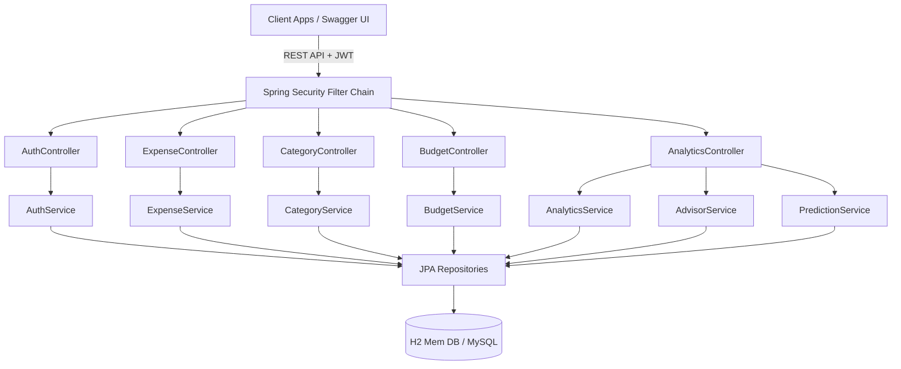

# FinTrack AI - Smart Expense Tracker & Financial Assistant

FinTrack AI is a smart personal finance backend application designed to help users track expenses, manage budgets, analyze spending trends, and receive automated, rules-based financial advice and predictions.

## Architecture



---

## Tech Stack
- **Framework**: Spring Boot 3.2.5 (Java 17)
- **Security**: Spring Security & JSON Web Tokens (JJWT)
- **Database**: H2 (In-memory, development) / MySQL 8.0 (Production)
- **Object Mapping**: MapStruct & Lombok
- **API Documentation**: Springdoc OpenAPI (Swagger UI)
- **Containerization**: Docker & Docker Compose

---

## Getting Started

### Prerequisites
- **Java 17** Installed
- **Maven** Installed
- **Docker** & **Docker Compose** (Optional, for production containers)

### Running Locally (Development)
1. **Clone the repository** and navigate to the project directory:
   ```bash
   cd fintrack-ai
   ```
2. **Build and test the application**:
   ```bash
   mvn clean package
   ```
3. **Run the application**:
   ```bash
   mvn spring-boot:run
   ```
4. **Access the application**:
   - The server starts on port `8080`.
   - **Swagger UI**: Visit [http://localhost:8080/swagger-ui.html](http://localhost:8080/swagger-ui.html) to interact with the endpoints.
   - **H2 Database Console**: Visit `http://localhost:8080/h2-console` (JDBC URL: `jdbc:h2:mem:fintrackdb`, User: `sa`, Password: `[leave empty]`).

### Running with Docker (Production)
To spin up both the MySQL database and the Spring Boot application in containers:
```bash
docker-compose up --build
```
This builds the Docker image and configures:
- MySQL instance on port `3306`.
- App container on port `8080`.

---

## API Endpoints

### 1. Authentication (`/api/auth`)
- `POST /api/auth/register` - Register a new user account.
- `POST /api/auth/login` - Authenticate and retrieve a JWT access token.

### 2. Expenses (`/api/expenses`)
- `GET /api/expenses` - Get list of expenses. Supports:
  - `category` (String) filter.
  - `startDate`/`endDate` (YYYY-MM-DD) filters.
  - `search` (String) title/description search.
  - `page`/`size` pagination.
- `GET /api/expenses/{id}` - Fetch details of a specific expense.
- `POST /api/expenses` - Create a new expense.
- `PUT /api/expenses/{id}` - Update an existing expense.
- `DELETE /api/expenses/{id}` - Delete an expense record.

### 3. Categories (`/api/categories`)
- `GET /api/categories` - Fetch all expense categories (available to all users).
- `POST /api/categories` - Add a new category (**Admin only**).
- `PUT /api/categories/{id}` - Update a category name (**Admin only**).
- `DELETE /api/categories/{id}` - Delete a category (**Admin only**).

### 4. Budgets (`/api/budgets`)
- `POST /api/budgets` - Set a monthly budget limit.
- `GET /api/budgets?month=YYYY-MM` - Get the budget limit for a specific month.
- `GET /api/budgets/usage?month=YYYY-MM` - Retrieve budget limit usage (Limit, Spent, Remaining, Percentage).

### 5. Analytics & Advice (`/api/analytics`)
- `GET /api/analytics/summary?month=YYYY-MM` - Retrieve a dashboard summary.
- `GET /api/analytics/breakdown?month=YYYY-MM` - Get a category breakdown (spent, share percentage).
- `GET /api/analytics/trends?limit=N` - Fetch chronological spending totals for the past N months.
- `GET /api/analytics/suggestions` - Get custom financial advice and warnings.
- `GET /api/analytics/projection` - Get a linear spending projection for the current month.
